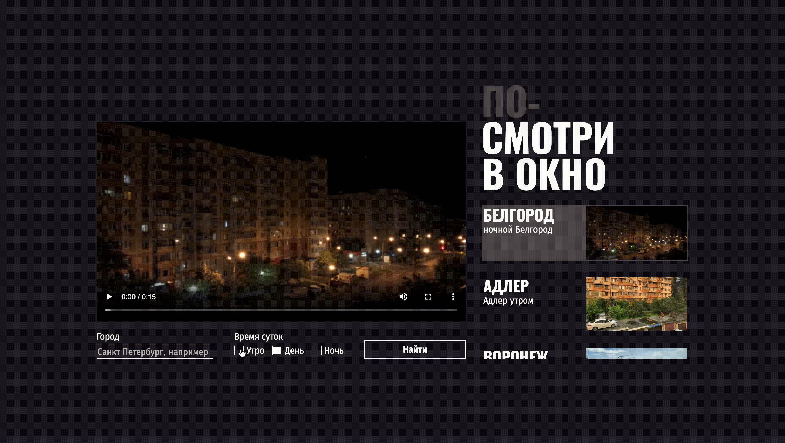

# ПОСМОТРИ В ОКНО 👀
Интерактивная страница, предоставляющая возможность просмотра видео с выбранным городом из списка, в определенное время суток.

**[Ссылка на макет Figma](https://www.figma.com/file/QHcvX1RsUI89CulRB7HLk6/%234-%D0%9F%D0%BE%D1%81%D0%BC%D0%BE%D1%82%D1%80%D0%B8-%D0%B2-%D0%BE%D0%BA%D0%BD%D0%BE?node-id=0%3A1&t=tJOMMSaw5EIu481X-1)**

## Что было сделано?
Написан CSS для работающего приложения.

## Функциональность приложения:

* При загрузке страницы скрипт получает данные из внешнего источника, отрисовывает пять карточек с видео и кнопку, чтобы подгрузить дополнительные карточки. Ещё он подставляет адрес первого из загруженных роликов в тег video.
* Скрипт отслеживает клик по карточкам и переключает текущее видео в зависимости от выбранной карточки.
* Cкрипт следит за отправкой формы. После отправки он ищет в базе данных совпадения по введённым параметрам и перерисовывает страницу с данными, полученными из нового запроса.
* В случае ошибок, на место блока с видео подставляется блок с сообщением об ошибке. А пока идёт поиск, в блоки с видео и карточками подставляются прелоадеры, отображающие анимацию процесса загрузки.

## Технологии
* Flex, Grid - системы
* Позиционирование прелоадеров
* Фреймы
* Встраиваемый контент (video)
* Сокрытие чекбокса по умолчанию, стилизация инпута, кнопки и чекбокса
* Стилизация состояния элементов формы и кнопок, поля ввода
* Использование элементов доступности (:focus-visible), применение селектора :has()

## Установка и запуск

1. Склонируйте репозиторий: **https://github.com/Khimichek/posmotri_v_okno.git**
2. Перейдите в папку проекта: `cd your-repo`
3. Откройте **index.html** в вашем браузере, чтобы увидеть веб-сайт.